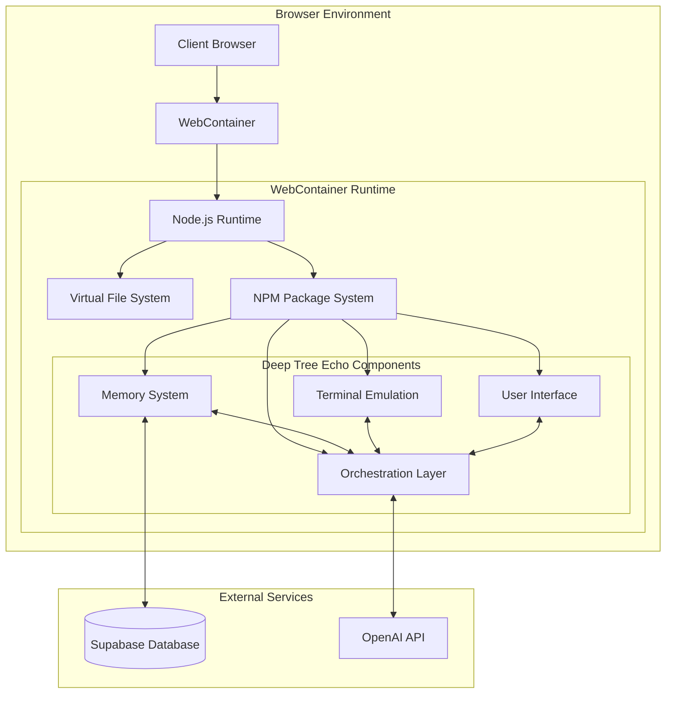

# Deep Tree Echo

Deep Tree Echo is an advanced AI workspace environment with integrated memory systems and interactive components. It provides a unique interface for exploring AI concepts, cognitive architectures, and creative development.

## Features

- **Echo Home Map**: Navigate through different specialized rooms, each with unique functionality
- **Memory System**: Store and retrieve information using advanced vector embeddings and semantic search
- **AI Chat**: Interact with Deep Tree Echo's AI capabilities through a conversational interface
- **Workshop**: Access development tools and creative coding environments
- **Visualization Studio**: Transform abstract data into insightful visual representations

## Architecture

Deep Tree Echo is built on a modular architecture that combines several key components:



## Core Concepts

### Echo State Networks

Deep Tree Echo utilizes Echo State Networks (ESNs) for temporal pattern recognition and adaptive learning. These networks feature:

- Reservoir computing with recurrent connections
- Fixed internal weights with trained output weights
- Ability to process temporal sequences efficiently
- Self-morphing capabilities for adaptive learning

### Memory System

The memory system is inspired by human cognition and includes multiple memory types:

- **Episodic Memory**: Stores experiences and events
- **Semantic Memory**: Contains facts, concepts, and general knowledge
- **Procedural Memory**: Handles skills and processes
- **Declarative Memory**: Explicit knowledge that can be verbalized
- **Implicit Memory**: Unconscious, automatic knowledge
- **Associative Memory**: Connected ideas and concepts

### Self-Morphing Stream Networks

Deep Tree Echo implements Self-Morphing Stream Networks (SMSNs) that enhance its core capabilities:

1. **Echo-Based Self-Modification**: Uses echo state networks for resonant patterns and adaptive topology
2. **Purpose-Driven Adaptation**: Maintains purpose vectors to guide modifications while preserving identity
3. **Identity-Preserving Growth**: Uses recursive pattern stores to maintain core identity during growth
4. **Collaborative Evolution**: Implements adaptive connection pools for enhanced collaboration
5. **Deep Reflection Integration**: Employs reflection networks for generating insights

## Getting Started

### Development

Run the development server:

```bash
npm run dev
```

### Deployment

Build the app for production:

```bash
npm run build
```

Then run the app in production mode:

```bash
npm start
```

## Technology Stack

- **Frontend**: React, Tailwind CSS, Framer Motion
- **Backend**: Remix, Node.js
- **Database**: Supabase
- **AI Integration**: OpenAI API
- **Vector Storage**: Supabase Vector Extension

## Contributing

Contributions are welcome! Please feel free to submit a Pull Request.

## License

This project is licensed under the MIT License - see the LICENSE file for details.